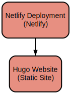

# Hugo Learn Theme Documentation Site

A multilingual documentation website built with Hugo that provides comprehensive guides and tutorials with support for English and Vietnamese languages. The site uses the Hugo Learn theme to deliver a clean, organized documentation experience with advanced features like search, syntax highlighting, and Mermaid diagrams.

This project serves as a documentation platform built using the Hugo static site generator with the Learn theme. It provides a structured way to create and maintain technical documentation with features like:

- Multilingual support for English and Vietnamese
- Full-text search functionality
- Syntax highlighting for code blocks
- Mermaid diagram integration
- Responsive design for mobile and desktop
- Custom shortcodes for enhanced content formatting
- Google Analytics integration
- Automated deployment to GitHub Pages

## Repository Structure
```
.
├── archetypes/          # Content templates
├── content/            # Main documentation content
│   ├── _index.md      # Homepage content in English
│   ├── _index.vi.md   # Homepage content in Vietnamese
│   └── [sections]/    # Documentation sections with .md files
├── layouts/           # Custom layout templates
│   ├── partials/     # Reusable template parts (header, footer, etc.)
│   └── shortcodes/   # Custom shortcodes for content enhancement
├── static/           # Static assets (CSS, images)
├── themes/           # Hugo Learn theme
└── config.toml       # Site configuration
```

## Usage Instructions

### Prerequisites
- Hugo Extended v0.124.1 or later
- Git
- Node.js (optional, for some theme features)

### Installation

1. Clone the repository:
```bash
git clone <repository-url>
git submodule update --init --recursive
```

2. Install Hugo Extended:

**MacOS:**
```bash
brew install hugo
```

**Linux:**
```bash
sudo apt-get install hugo
```

**Windows:**
```bash
choco install hugo-extended
```

### Quick Start

1. Start the Hugo development server:
```bash
hugo server
```

2. Visit http://localhost:1313 in your browser

3. Add new content:
```bash
hugo new content/my-section/_index.md
```

### More Detailed Examples

Creating a new documentation page:

```markdown
---
title: "My New Page"
date: 2024-03-21
draft: false
---

# My Documentation

Content goes here...
```

Adding a Mermaid diagram:

```markdown

graph TD
    A[Start] --> B{Decision}
    B -->|Yes| C[OK]
    B -->|No| D[Cancel]

```

### Troubleshooting

Common issues and solutions:

1. **Missing theme error**
   - Error: `Error: module "hugo-theme-learn" not found`
   - Solution: Run `git submodule update --init --recursive`

2. **Content not showing up**
   - Check if the content file has `draft: true` in its front matter
   - Verify the file is in the correct location under content/
   - Ensure proper file naming convention is followed

3. **Mermaid diagrams not rendering**
   - Make sure you're using the correct shortcode syntax
   - Check browser console for JavaScript errors
   - Verify the Mermaid JavaScript is loading properly

## Data Flow

The documentation site processes content through Hugo's build pipeline, converting Markdown files to HTML with theme styling applied.

```ascii
[Markdown Files] -> [Hugo Processing] -> [HTML Generation]
     |                    |                    |
     v                    v                    v
  Content            Templates           Static Site
  (.md)             (.html)             (public/)
```

Key component interactions:
- Content files are processed through Hugo's template engine
- Shortcodes extend Markdown functionality
- Theme templates provide consistent styling and layout
- Static assets are copied directly to output
- Multilingual content is processed based on language settings
- Search index is generated from content during build

## Infrastructure



The site is deployed using GitHub Actions to GitHub Pages:

- **Build Job**:
  - Uses Ubuntu latest runner
  - Installs Hugo Extended v0.124.1
  - Installs Dart Sass for theme styling
  - Builds site with minification enabled
  - Uploads built site as artifact

- **Deploy Job**:
  - Deploys built site to GitHub Pages
  - Configures custom domain if specified
  - Sets up proper permissions for deployment